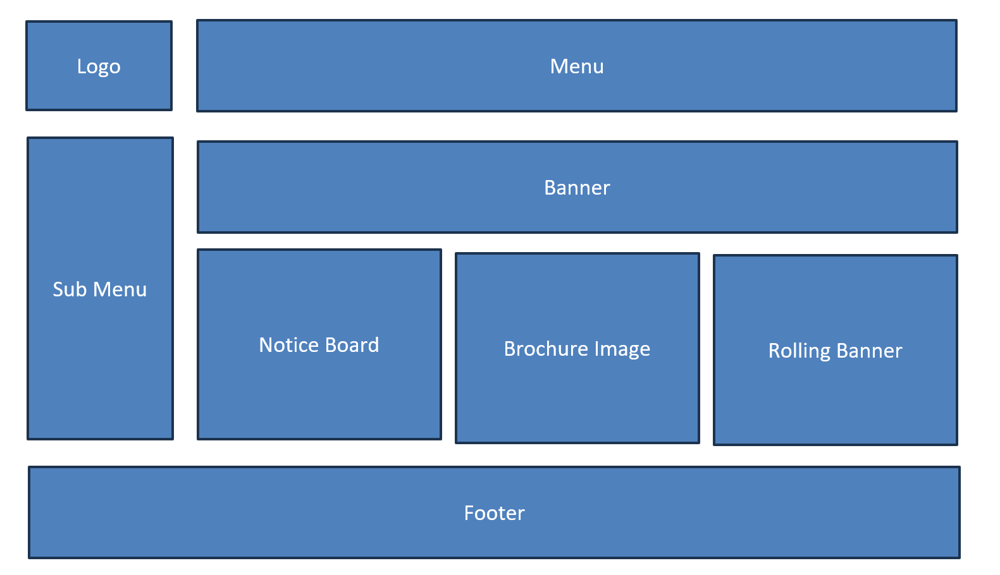
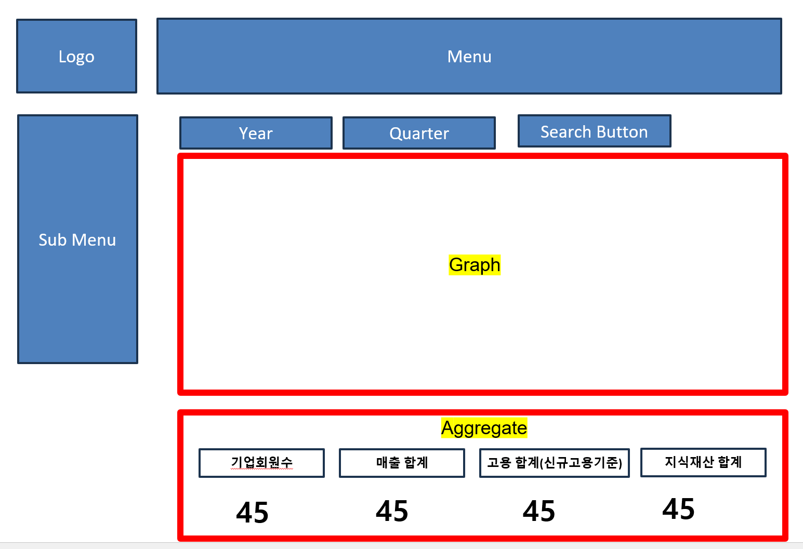
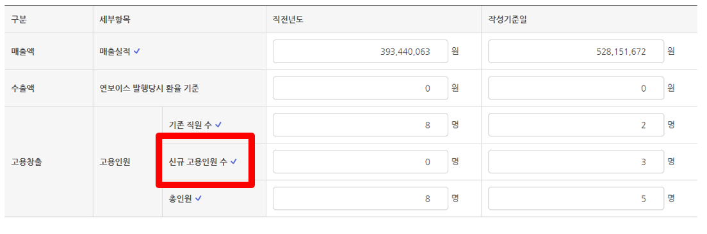
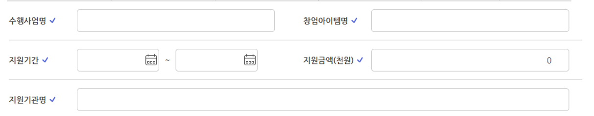
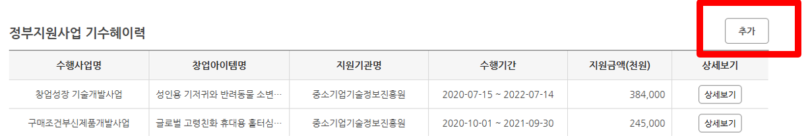
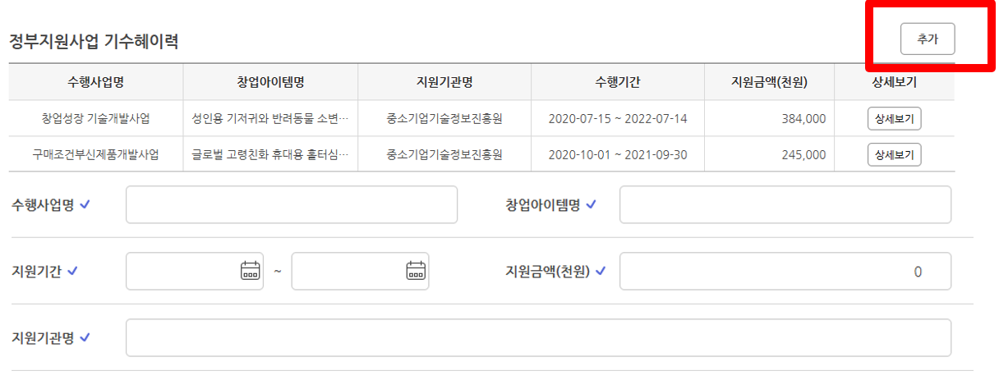
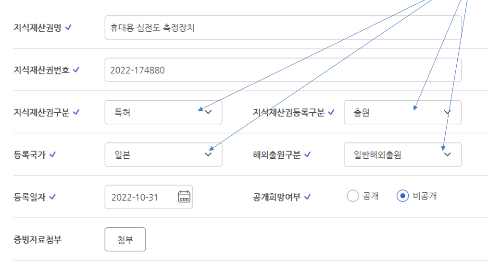
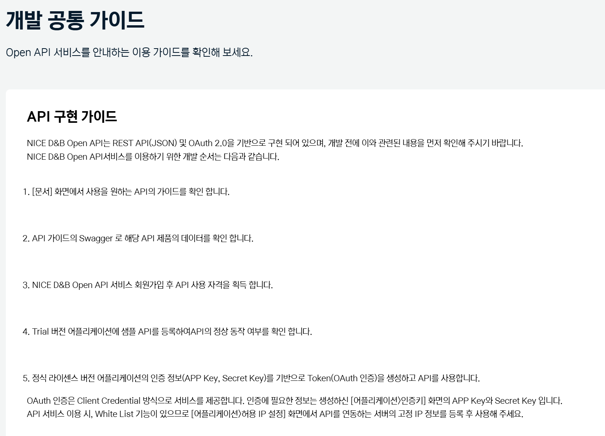

# 江原大学说明文档

---

江原大学创业高度化网站

网站目的：江原道企业业绩管理系统。

企业在网站注册后，只有在管理员认证后才能登录，

各企业按年度和季度记录和管理业绩的网站。

管理员注册公告板，查询企业（通过Nice D&B网站使用企业信息OpenAPI提取）及管理。

<使用技术>

前端2个网站，后端API联动实现。

前端：React, JS6, Tailwind

后端：Python（后续可能实现LLM创业Talk）

数据库：PostgreSQL

<企业主网站（面向江原道企业客户）>

通过k-talk.kr主页的横幅进入新的创业Talk网站。

创业Talk网站完成后，将在k-talk.kr网站上制作横幅。（k-talk.kr不是开发的网站）

1. 登录页面（4页）：

第一个页面是登录页面。

注册会员后，经管理员批准后可登录

ID输入营业执照号码10位数字（输入时自动转换为000-00-00000格式）

添加ID/密码查找功能

密码加密保存

添加密码显示功能

找回密码页面：通过该公司邮箱发送可重置密码的URL。

在该邮箱中点击后可以重置密码。

2. 会员注册页面（5页）：

[输入项目]

营业执照号码：用作ID。

营业执照号码（000-00-00000）格式

必须输入10位数字（自动转换为000-00-00000格式）

企业名称，

密码（添加密码显示功能），

所在地区：单选框形式，选择项2个：江原特别自治道、江原以外

创业分类：单选框形式，选择项2个：预备、创业

法人号码：13位数字oooooo-ooooooo格式，只输入数字会自动添加连字符

地址（使用地址搜索网站自动注册），详细地址

代表人姓名

企业负责人姓名

企业负责人部门名称

企业负责人职位名称

移动电话号码

电子邮件

公司标志图片文件上传（扩展名只能是图片文件，上传一个）

营业执照文件上传（文档文件和图片都可以上传，一个）

代表电话号码

业务领域：下拉框形式，下拉框的项目以JSON格式从基本设置文件中提取（便于维护）

销售额

员工数

成立日期：从日历中选择

网站URL

主要业务及产品

产业合作期望领域：复选框形式，从JSON基本设置文件中提取

条款页面

底部需要条款同意复选框。

点击"查看内容"时，以弹窗形式显示条款内容。（从基本设置文件中获取）

必须勾选标记为必选的项目才能进入下一页

显示全部同意时全部选中，

全部同意（点击查看内容）

[必选]使用条款同意（点击查看内容）

[必选]个人信息收集及使用同意（点击查看内容）

[必选]个人信息第三方提供（点击查看内容）

[可选]选择信息收集及使用同意（点击查看内容）

必须输入所有必填项目才能激活注册按钮。

会员退出时不要物理删除现有会员，只进行逻辑删除。（flag处理）

[所有页面通用事项]

* 所有文件保存形式在upload文件夹下创建企业ID数字文件夹后保存。
* 保存文件时不要直接使用原始文件名，使用转换后的名称，原始名称保存在数据库表中
* 修改删除附件时，正常处理后删除原有附件。文件名必须唯一。
* 所有数据输入、修改、删除处理时用transaction包装并进行roll back处理。
* 文本输入项目需要SQL注入防御处理

3. 企业业绩管理主页面（6页）

- 主页面构成：

顶部主菜单和左侧子菜单

中心部分构成：主横幅(1)图片（点击时如有URL则跳转到该页面）

公告（提取管理员输入的内容最近5条）

新闻资料（提取管理员输入的最近1条缩略图，点击时跳转到该公告板）

管理员输入的主横幅(2)（小尺寸）- 管理员输入2个主横幅((1),(2))

底部页脚构成：公共文件模板处理

点击使用条款、个人信息处理方针时弹窗处理（相关内容从txt或html中提取）

- 网站设计模板参照Tailwind设计模板进行制作。
- 主菜单4个：系统介绍、项目、业绩管理、一站式支持

- 每个主菜单都会自动显示各自的横幅图片。

- 管理员为每个主菜单输入横幅，共需输入5个横幅-主页用1个，各主菜单4个

4. 主菜单1：系统介绍（7页）

- 中心部分的横幅从管理员页面的横幅管理中获取系统介绍菜单的横幅。

- 如有URL则跳转到该页面。
- 内容：

预计稍后输入。在管理员中以编辑器窗口制作可修改内容。

即，管理员需要各页面的内容管理页面。

5. 主菜单2：项目（8页）

- 横幅图片从管理员横幅管理中提取项目主菜单的横幅。如有URL添加点击
- 内容：

公告板文章提取：

屏幕一页提取10篇文章基本设置。- 文章数量可选择（10个、20个、30个、50个）

添加文章搜索功能：可按标题/内容文本搜索

每个公告文章设置"创业者申请"按钮。

点击此按钮时以弹窗形式可输入最多5个附件

保存的数据：会员ID，

最多5个附件（保存到文件夹时用其他名称保存，在数据库中保存原始文件名），

（附件文件夹为各/upload/该企业ID/公告板/）

注册日期，

受理状态

点击各公告板标题时跳转到详细公告内容页面。

6. 主菜单3：业绩管理-企业信息（9页）

- 左侧子菜单3个：企业信息、业绩查询、业绩输入
- 横幅图片从管理员横幅管理中提取项目主菜单的横幅。如有URL添加点击
- 内容：企业信息修改页面

原有输入内容中营业号码（ID）不可修改

其余可修改

7. 主菜单3：业绩管理-业绩查询（10页）

- 左侧子菜单3个：企业信息、业绩查询、业绩输入
- 横幅图片从管理员横幅管理中提取项目主菜单的横幅。如有URL添加点击
- 内容：添加搜索关键词：可按年度、季度、状态值（下拉框：提交/补充/批准）等状态搜索

底部添加业绩输入按钮（子菜单中也有业绩输入菜单）

业绩提交后只有在管理员批准后才能在此页面确认。

在屏幕上添加提示语："管理员批准前的内容只有在管理员批准后才会显示在屏幕上"等提示语。

构成只显示该企业的业绩资料。- 不能显示其他企业的业绩管理。（注意）

该企业直接上传的业绩管理可以删除/修改。

所有附件只能是pdf。

已批准的文章可以确认本企业的业绩管理上传文章并可下载文件。

文章的提取项目：文档类型、文件名、文档状态、文档确认（下载按钮）

8. 主菜单3：业绩管理-业绩输入（11~13页）

- 业绩输入以3种形式接收输入。- 销售雇佣、政府支持既受惠历史、知识产权（用标签区分）
- 业绩输入按上述3种形式按年度和季度输入。
- 输入内容画面如下图构成。输入项目只填写数字，3位数单位自动显示逗号

<销售雇佣> - 11页

<政府支持既受惠历史> - 12页

如下画面构成输入项目：

执行项目名、创业项目名、支持期间（开始日~结束日日期选择）支持金额（千元）、支持机关名

点击"添加"按钮时像文章一样添加行。

<知识产权>

输入项目：

知识产权名、知识产权号码、知识产权分类、知识产权注册分类，

注册国家、海外申请分类、注册日期、公开期望与否（公开、非公开单选按钮选择），

证明资料附件（最多5个）- 附件保存位置：/upload/该企业ID/业绩管理

箭头标记项目的下拉框项目从设置文件中获取功能实现。

- 3个标签必须可以临时保存，也必须有最终业绩提交按钮。

即，各标签底部设置"临时保存"按钮和"实绩提交"按钮，临时保存时不向管理员请求批准，只有点击"业绩提交"按钮时才向管理员请求批准。即此时管理员的业绩管理文章中可以批准。管理员在临时保存阶段无法得知。

9. 主菜单3：一站式支持（14、15页）

- 子菜单2个：常见问题、1:1咨询
- 横幅图片从管理员横幅管理中提取项目主菜单的横幅。如有URL添加点击
- 内容1：常见问题

只以查询功能提取管理员输入的"常见问题"项目到屏幕。

- 内容2：1:1咨询

客户留言后通过email发送。

需要单独的页面来查询该企业客户在"1:1咨询"中输入的内容。（历史管理意义）

1:1咨询输入项目

姓名、接收回复的邮箱地址、接收回复的手机号码、咨询内容、附件最多3个

发送eMail按钮

<管理员页面>

管理员主页面（17、19页）- 企业现状页面为基本主页面

1. 企业现状：各子页面3个

- 企业现状：总企业会员数、销售合计、雇佣合计（新雇佣基准）、知识产权合计

只统计已批准的。

必须可按年度、季度搜索。基本值显示最近年度的全部季度。

但如果今年没有季度数据则必须显示提示语。

各详细内容可下载为Excel。

图表表现：企业会员数/销售合计/雇佣合计/知识产权合计

企业客户输入的业绩管理（仅限已批准的）输入营业执照号码和年度/季度期间

在屏幕上按年度/季度显示销售和雇佣两种折线图。

- 横幅管理：主横幅（顶部）、主菜单4个的下级横幅图片文件上传，

各横幅点击时需要URL输入栏（选择输入）

- 弹窗管理：弹窗开放日期、弹窗结束日期，

弹窗图片、弹窗内容文本输入（用编辑器窗口输入文本）

弹窗点击链接）、所有弹窗需要"今日不再查看"功能。

2. 企业搜索（18页）：Nice D&B外部API联动

利用Nice D&B外部网站，

输入营业执照号码、代表人姓名、地区后点击查询按钮可查询该企业的信息。

NiceDnb openAPI联动：

https://openapi.nicednb.com/

通过NiceDnb提取的项目：

- 企业概要

企业名、代表人、营业执照号码、法人注册号码、电话号码、业务开始日期、地址、企业形态，

标准产业分类（证明）、主要产品（业务）、财务结算基准日、信用等级有效期间、信用等级评价日

- 主要财务事项 - 以表格形式显示

财务项目按年度提取最近3个（例如2022/12、2023/12、2024/12）

总资产、自有资本、资本金、借款、金融费用、销售额、营业利润、当期纯利润

纯利润增长率、自有资本比率、负债比率、借款依存度、金融费用负担率、销售额增长率，

销售额营业利润率、销售额纯利润率

3. 业绩管理（20页）

查看企业输入的业绩管理并批准。

如需要补充，将文档状态更改为补充，并添加需要补充部分的评论通知。

业绩资料文章项目：文档类型、文件名、文档状态、文档确认

4. 项目（21页）

8页的企业业绩管理项目中显示的管理员文章。

输入项目：项目名、受理对象、业务开始日期、受理截止日期，

图片附件1个（必须在公告文章详细页面显示）、文件附件2个（用于下载）

项目必须可以注册/修改/删除。

5. 运营管理（22页）

子菜单：公告、新闻资料、滚动横幅

公告板管理：

标题，

内容（编辑器窗口），

文件附件最多3个，

图片附件（图片在详细页面显示），

撰写日期，

撰写者，

新闻资料管理：

<输入项目>

标题，

图片文件上传：文件上传时自动保存为缩略图，

主页面显示缩略图，点击时原始文件以弹窗形式显示

撰写日期，

撰写者

滚动横幅管理：主页面右下方新闻资料右侧显示的滚动横幅

输入项目：横幅图片、点击URL地址、主页面显示与否Yes/No标记

显示标志为Yes的情况才在企业主页面中滚动

自动以15秒为单位滚动，必须有back、forward、pause按钮。

6. 企业会员（23、24页）

显示企业会员信息，可以设置批准与否。

企业会员必须可以保存为Excel。

条件搜索查询时，条件搜索的结果必须下载为Excel。

Excel必须包含企业会员的所有信息。（文件附件和图片附件只需输入标题。）

企业会员搜索功能：企业名、代表人姓名、按业务领域搜索（业务领域中显示的下拉框内容预计稍后提供）

文章列表中显示的项目：企业名、代表人、营业号码、总部地址、行业

点击时查询企业会员详细信息。

文章显示数量可动态调整，

点击表格标题时按该标题的order by重新排列列表。

详细页面中点击"企业搜索"按钮时自动进行该企业的企业搜索

点击"业绩管理"按钮时显示该企业业绩管理公告板

NiceDnb联动

https://openapi.nicednb.com/#/guide/common/oauth

目前还没有API联动信息。预计稍后收到App Key、App Secret信息后应用。

以下是提取API信息的开发指南。

OAuth认证

API调用

API实现

