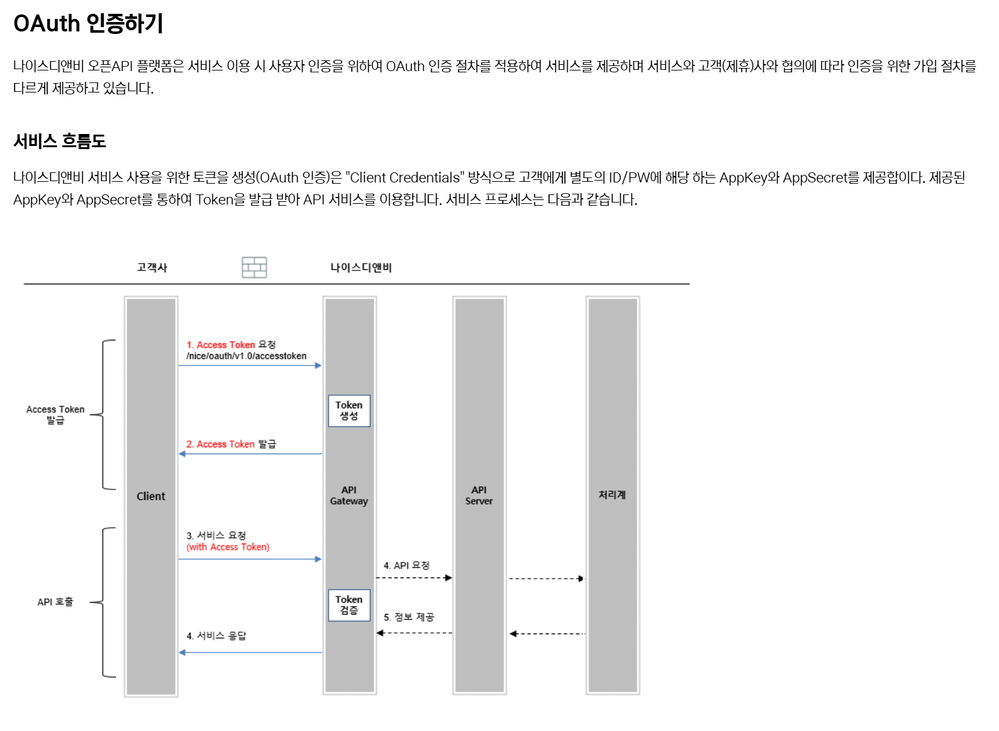
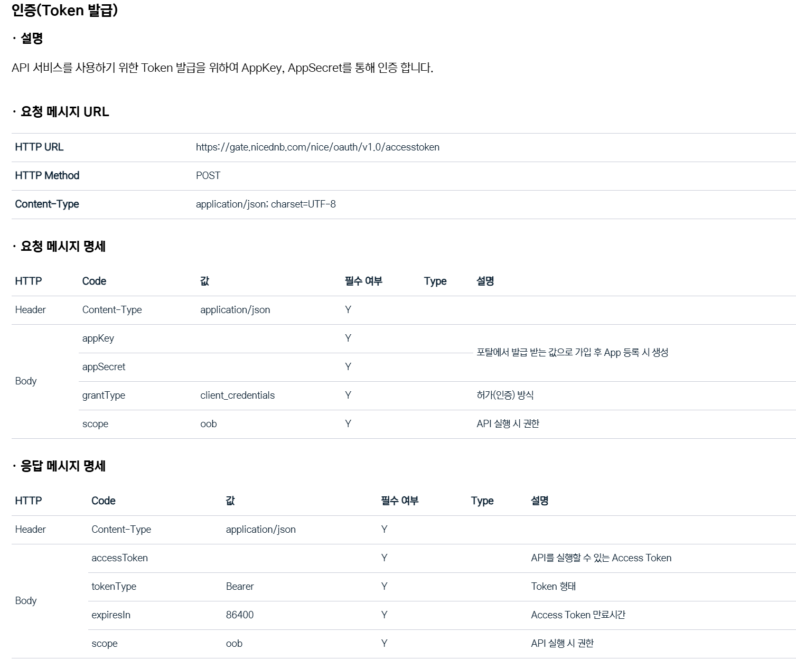
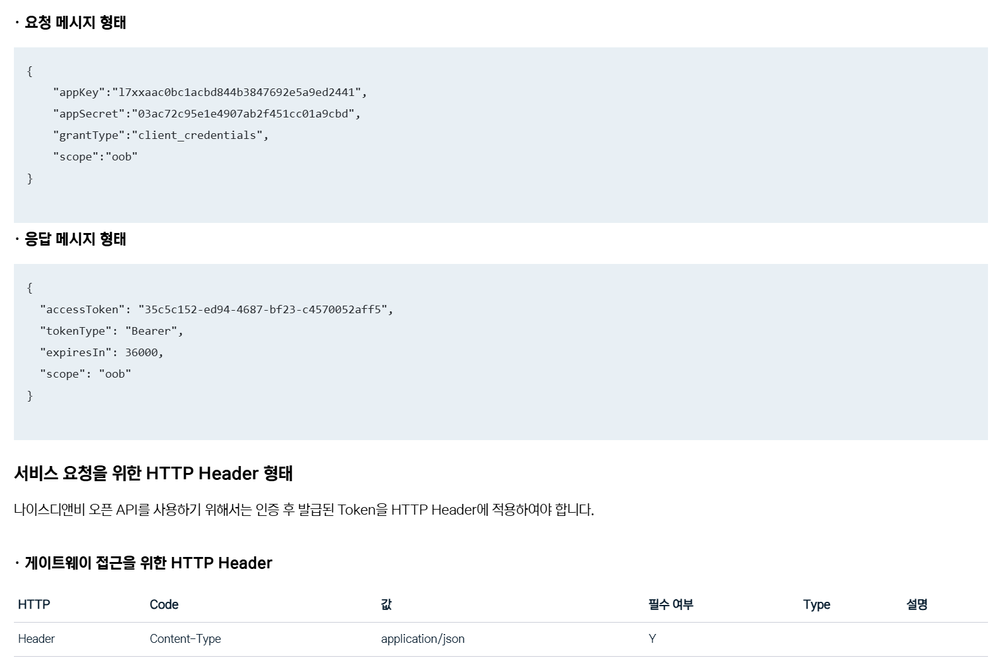
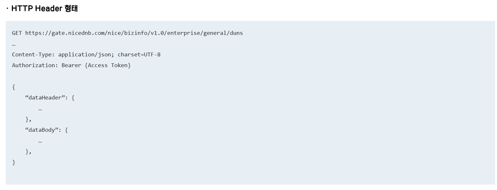
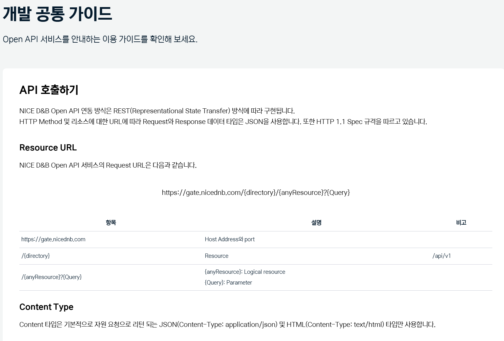
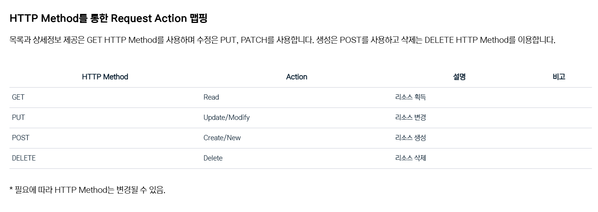

# GangwonUniv Description

# <어드민 페이지>

어드민 메인페이지 (17, 19 page) - 기업현황 페이지가 기본 메인페이지

1. 기업현황: 각 서브 페이지3개

– 기업현황 : 전체 기업회원수, 매출 하볘, 고용합계(신규고용기준), 지식재산합계

승인된것만 집계한다.

년도, 분기 별로 검색가능해야 한다. 기본값은 최근년도의 전체 분기를 보여준다.

단, 올해 분기 데이터가 없으면 안내 문구를 띄워야 한다.

각 상세내용은 엑셀로 다운로드 가능하도록.

그래프 표현 : 기업회원수/ 매출합계/고용합계/지식재산 합계

기업고객이 입력한 성과관리(승인된 것에 한하여) 사업자등록번호와 년도/분기 기간을 입력하면

매출과 고용 두가지의 꺽은선 그래프를 년도/분기별로 화면에 보여준다.

- 배너관리 : 메인배너 (상단), 대메뉴 4개의 하위 배너 이미지 파일업로드,

각 배너 클릭시 url입력란 필요(선택입력)

- 팝업관리 : 팝업 오픈날짜, 팝업 종료날짜,

팝업 이미지, 팝업 내용 텍스트 입력(에디터 창으로 텍스트입력)

팝업 클릭 링크), 모든 팝업은 “오늘 보지 않기” 기능 필요.

2. 기업검색 (18 page) : 나이스디앤비 외부 API연동

나이스대앤비 외부 사이트를 이용하여 ,

사업자등록번호, 대표자명, 지역을 넣고 조회버튼을 클릭하면 해당 기업의 정보를 조회할 수 있다.

NiceDnb openAPI연동 :

https://openapi.nicednb.com/

NiceDnb 통한 추출 항목:

- 기업개요

기업명, 대표자, 사업자등록번호, 법인등록번호, 전화번호, 사업시작일, 주소, 기업형태,

표준산업분류(입증), 주요제품(사업), 재무결산기준일, 신용등급유효기간, 신용등급 평가일

- 주요재무사항 – 테이블 형태로 보여준다

재무항목은 년도 별로 최근3개 추출 (예. 2022/12, 2023/12, 2024/12)

총자산, 자기자본, 자본금, 차입금, 금융비용, 매출액, 영업이익, 당기순이익

순이익증가율, 자기자본비율, 부채비율, 차입금의존도, 금융비용부담률, 매출액증가율,

매출액영업이익률, 매출역순이익귤

3. 성과관리 (20 page)

기업이 입력한 성과관리를 보고 승인을 해준다.

만약 보완이 필요한 경우 문서상태를 보완으로 변경하고 보완해야 할 부분을 코멘트를 넣어서 알려준다.

성과자료 게시글 항목 : 문서유형, 파일명, 문서상태, 문서확인

4. 프로그램 (21page)

8page의 기업성과관리 프로그램에 보여지는 관리자 게시글.

입력항목: 프로그램명, 접수대상, 사업시작일, 접수마감일,

이미지 첨부1개(공고게시글 상세페이지에 보여야 함), 파일첨부 2개(다운로드용)

프로그램은 등록/수정/삭제가 가능해야 함.

5. 운영관리 (22page)

서브 메뉴 : 공지사항, 보도자료, 롤링배너

공지사항 게시판 관리 :

제목,

내용(에디터 창),

파일첨부 3개까지 가능,

이미지 첨부(이미지는 상세페이지에 보이도록),

작성일,

작성자,

보도자료 관리:

<입력항목>

제목,

이미지파일 업로드: 파일 업로드 시 썸네일 이미지로 자동 저장 필요,

메인페이지는 썸네일 이미지가 보이도록하고 클릭시 원본파일이 레이어팝업으로

작성일,

작성자

롤링배너 관리 : 메인화면 오른쪽 하단에 보도자료 오른쪽에 보이는 롤링 배너

입력항목 : 배너이미지, 클릭 URL주소, 메인페이지 노출 여부 Yes/No표시

노출 flag는 Yes인 경우만 기업 메인 페이지에서 롤링

자동으로 15초 단위로 롤링 되도록, back, forward, pause 버튼 있어야 함.

6. 기업회원 (23, 24page)

기업회원 정보를 보여주고, 승인여부를 설정할 수 있다.

기업회원은 엑셀로 저장이 가능해야 한다.

조건 검색으로 조회한 경우 조건 검색된 결과가 엑셀로 다운로드 되어야 한다.

엑셀은 기업회원의 모든 정보가 들어가야 한다. (파일첨부와 이미지 첨부는 제목만 들어가면 된다.)

기업회원 검색 기능 : 기업명, 대표자명, 사업분야별 검색 (사업분야에 나올 select box내용은 추후제공예정)

게시글 목록에 보여지는 항목 : 기업명, 대표자, 사업자번호, 본사주소, 업종

클릭 시 기업회원 상세정보 조회되도록.

게시글 보여지는 개수는 동적으로 조정 가능하도록,

테이블 헤더 클릭 시 해당 헤더의 order by 로 리스트가 재 배열 되어야 한다.

상세페이지에서 해당 기업의 기업검색이 자동으로 되도록 “기업검색” 버튼 클릭 시 해당 기업검색이 되도록

“성과관리” 버튼 클릭 시 해당 기업 성과관리 게시판 나오도록

NiceDnb 연동

https://openapi.nicednb.com/#/guide/common/oauth

아직 API연동정보가 없음. 추후 App Key, App Secret 정보를 받고 적용예정.

아래는 API정보를 추출하기 위한 개발 가이드.

OAuth 인증

API 호출

# [모든 페이지 공통사항]

* 모든 파일 저장의 형태는 upload폴더아래에 기업아이디 숫자로 폴더 생성 후 저장.
* 파일 저장 시 이름은 원본파일 이름 그대로 사용하지 말고, 변환된 이름을 이용하고 원본이름은 디비 테이블에 저장
* 첨부파일 수정 삭제 시 기존에 첨부된 파일은 정상 처리 후 삭제처리한다. 파일 이름은 유니크 해야 한다.
* 모든 데이터 입력 수정 삭제 처리시 transaction으로 묶고 roll back 처리.
* text입력항목은 SQL injection 방어 처리 필요
