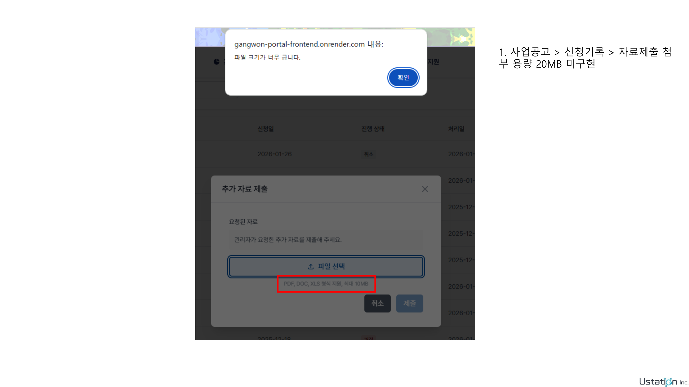
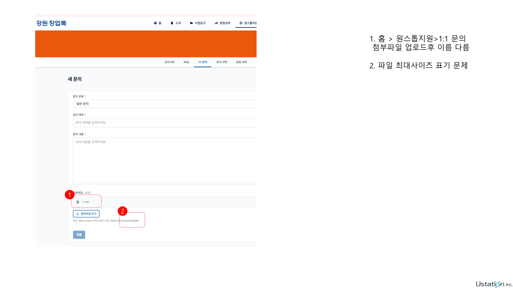
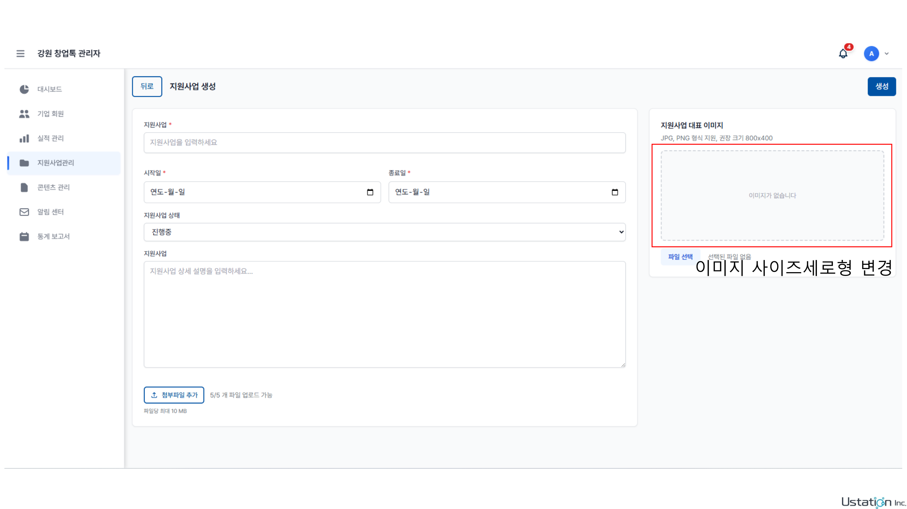
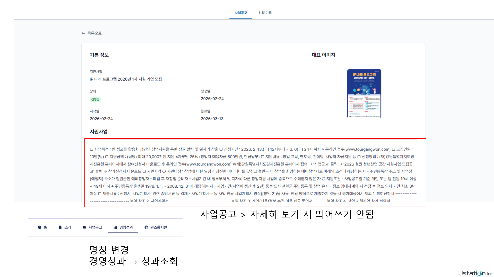
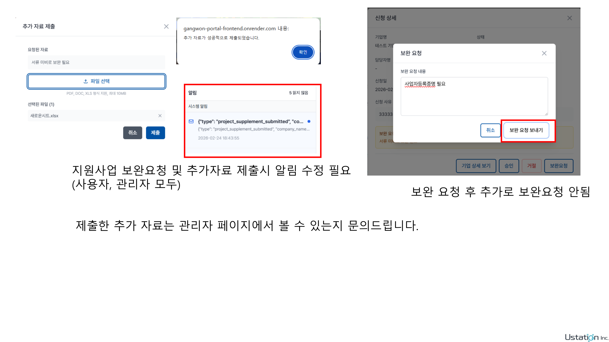

# Gangwon Bug Fix Report 260224

**Source:** `Gangwon_BugFixReport_260224.pptx`
**Total Pages:** 5
**Format:** Page Image + Text
**Updated:** 2026-03-01
**Status:** ✅ Phase 4 实施完成 (9/9 完成)

---

## Page 1

### 📷 Page Image



### 📝 Text Content

```
1. 사업공고 > 신청기록 > 자료제출 첨부 용량 20MB 미구현
```

### ✍️ Notes

> **需求 #1**: 사업공고 > 신청기록 > 추가 자료 제출 모달에서 파일 용량 제한이 여전히 10MB로 표시
>
> **原文**: 사업공고 > 신청기록 > 자료제출 첨부 용량 20MB 미구현
>
> **翻译**: 事业公告 > 申请记录 > 资料提交附件容量 20MB 未实现
>
> **分析**: 截图中可以看到：
>
> 1. 弹出"파일 크기가 너무 큽니다"（文件大小过大）的错误提示
> 2. 模态框底部显示 "PDF, DOC, XLS 형식 지원, 최대 10MB"（仍显示 10MB 而非 20MB）
> 3. 红色框标注的区域明确指出了 10MB 的错误限制
>
> **涉及文件**:
>
> - `frontend/src/member/modules/projects/components/ApplicationRecords/SupplementMaterialsModal.jsx` (L56-60: 硬编码 "최대 20MB" 但未使用 i18n 变量)
> - `frontend/src/member/modules/projects/locales/ko.json` (L244: uploadHint 仍写 "최대 10MB")
> - `frontend/src/member/modules/projects/hooks/useApplicationRecords.js` (L86: maxSize = MAX_DOCUMENT_SIZE 已正确 20MB)
> - `frontend/src/shared/utils/constants.js` (L59: MAX_DOCUMENT_SIZE 已正确 20MB)
>
> **根因**: `ko.json` 中 applicationRecords 部分的 `uploadHint` 值仍为 `"PDF, DOC, XLS 형식 지원, 최대 10MB"`，应改为使用 `{{maxSize}}` 变量并传入 20
>
> **实施**: ✅ 已完成 (2026-03-01)
> **修改**: `ko.json` L244 硬编码 10MB → `{{maxSize}}` 变量; `SupplementMaterialsModal.jsx` L57-60 传入 `{ maxSize: 20 }`
> **优先级**: 高

---

## Page 2

### 📷 Page Image



### 📝 Text Content

```
1. 홈 > 원스톱지원 > 1:1 문의
   첨부파일 업로드후 이름 다름
2. 파일 최대사이즈 표기 문제
```

### ✍️ Notes

> **需求 #2a**: 원스톱지원 > 1:1 문의에서 첨부파일 업로드 후 파일 이름이 원본과 다르게 표시됨
>
> **原文**: 홈 > 원스톱지원 > 1:1 문의 - 첨부파일 업로드후 이름 다름
>
> **翻译**: 首页 > 一站式支持 > 1:1 咨询 - 附件上传后文件名与原文件不同
>
> **分析**: 截图中标注 ① 的区域显示"첨부파일 (1/3)"，但文件名仅显示 "1.1 MB" 而非原始文件名。
> 这是上次 Bug Fix 260210 Issue 3 的同一个问题，可能是回归 Bug。
>
> **涉及文件**:
>
> - `frontend/src/member/modules/support/components/InquiryPage/InquiryAttachmentList.jsx` (L46: 使用 `att.originalName || att.name`)
> - 上传逻辑中可能未保留原始文件名
>
> ---
>
> **需求 #2b**: 파일 최대사이즈 표기 문제 (`{{maxSize}}` 변수 치환 안 됨)
>
> **原文**: 파일 최대사이즈 표기 문제
>
> **翻译**: 文件最大大小标记问题
>
> **分析**: 截图中标注 ② 的区域显示 `파일당 최대 {{maxSize}}MB`，`{{maxSize}}` 变量未被正确替换。
>
> **涉及文件**:
>
> - `frontend/src/member/modules/support/components/InquiryPage/InquiryAttachmentList.jsx` (L77: 调用 `t("member.support.attachmentHint")` 但未传入 `{ maxSize: 20 }` 参数)
> - `frontend/src/member/modules/support/locales/ko.json` (L74: `"attachmentHint": "PDF, Word, Excel, 이미지 형식 지원, 파일당 최대 {{maxSize}}MB"`)
> - `frontend/src/member/modules/support/locales/zh.json` (L76: 同样使用 `{{maxSize}}` 变量)
>
> **根因**: `InquiryAttachmentList.jsx` L77 调用 `t()` 未传 interpolation 参数
>
> **实施**: ✅ 已完成 (2a, 2026-03-01) / ✅ 已完成 (2b, 2026-03-01)
> **2a 修改**: `upload.service.js` `uploadAttachments()` 中保留原始文件名到 `originalName` 和 `name` 字段
> **2b 修改**: `InquiryAttachmentList.jsx` L77 添加 `{ maxSize: 20 }` 到 `t()` 调用
> **优先级**: 高 (2a), 中 (2b)

---

## Page 3

### 📷 Page Image



### 📝 Text Content

```
이미지 사이즈세로형 변경
사업공고 > 자세히 보기 시 띄어쓰기 안됨
명칭 변경
경영성과 → 성과조회
```

### ✍️ Notes

> **需求 #3a**: 관리자 지원사업 생성 → 대표이미지 사이즈 변경 (가로형 → 세로형)
>
> **原文**: 이미지 사이즈세로형 변경
>
> **翻译**: 图片尺寸改为纵向
>
> **分析**: 截图中红色框标注了管理员页面中"지원사업 대표 이미지"区域，仍然显示旧的提示 "JPG, PNG 형식 지원, 권장 크기 800x400"。
> 根据 260210 Bug Fix Issue 12，已经修改为 850x1200。但截图显示管理员页面仍然显示 800x400，可能是回归或遗漏。
>
> **涉及文件**:
>
> - `frontend/src/admin/modules/projects/ProjectForm.jsx` (L377: 已有 "850x1200")
> - `frontend/src/admin/modules/projects/locales/ko.json` (L78: imageHint 已有 "850x1200")
>
> **核实**: 需要核实上线部署是否包含了此修改。如果代码已修改但线上未更新，则非代码问题。
>
> ---
>
> **需求 #3b**: 사업공고 > 자세히 보기 시 띄어쓰기 안됨 (공고 상세 내용의 행간격/줄바꿈 문제)
>
> **原文**: 사업공고 > 자세히 보기 시 띄어쓰기 안됨
>
> **翻译**: 事业公告 > 查看详情时没有空格/换行
>
> **分析**: 截图中红色框标注的"지원사업" 详情内容区域，所有文字挤在一起没有换行。
> 这是 `dangerouslySetInnerHTML` 渲染的内容，如果内容存储为纯文本（非 HTML），则 `\n` 不会被渲染为换行。
>
> **涉及文件**:
>
> - `frontend/src/member/modules/projects/components/ProjectDetail/ProjectDetailContent.jsx` (L128: `dangerouslySetInnerHTML`)
> - 需要检查内容是 HTML 还是纯文本，添加 `white-space: pre-wrap` 或转换 `\n` 为 `<br/>`
>
> ---
>
> **需求 #3c**: 네비게이션 명칭 변경: 경영성과 → 성과조회
>
> **原文**: 명칭 변경 - 경영성과 → 성과조회
>
> **翻译**: 名称变更 - 经营成果 → 成果查询
>
> **涉及文件**:
>
> - `frontend/src/member/layouts/locales/ko.json` (L17: `"performance": "경영성과"` → `"성과조회"`)
> - `frontend/src/member/layouts/locales/zh.json` (对应中文)
>
> **实施**: ⬜ 确认中 (3a) / ✅ 已完成 (3b, 2026-03-01) / ✅ 已完成 (3c, 2026-03-01)
> **3b 修改**: `ProjectDetailContent.jsx` L125-131 添加 `white-space: pre-line; word-break: keep-all` + `\n` → `<br/>`
> **3c 修改**: `ko.json` `"경영성과"` → `"성과조회"`; `zh.json` `"经营成果"` → `"成果查询"`
> **优先级**: 中 (3a), 高 (3b), 低 (3c)

---

## Page 4

### 📷 Page Image



### 📝 Text Content

```
사업공고 > 자세히 보기 시 띄어쓰기 안됨
경영성과 → 성과조회
```

### ✍️ Notes

> **需求 #3b (续)**: 同 Page 3 的"띄어쓰기 안됨"问题
>
> 本页截图更清楚地展示了事业公告详情页的文字排版问题 — 内容完全没有换行和空格。
> 同时底部展示了导航栏，可以看到"경영성과"标签需要改为"성과조회"。
>
> **实施**: ✅ 已完成（同 Page 3 Issue 3b, 3c）

---

## Page 5

### 📷 Page Image



### 📝 Text Content

```
보완 요청 후 추가로 보완요청 안됨

지원사업 보완요청 및 추가자료 제출시 알림 수정 필요
(사용자, 관리자 모두)

제출한 추가 자료는 관리자 페이지에서 볼 수 있는지 문의드립니다.
```

### ✍️ Notes

> **需求 #4a**: 보완 요청 후 추가로 보완요청 안됨 (재보완 요청 불가)
>
> **原文**: 보완 요청 후 추가로 보완요청 안됨
>
> **翻译**: 补充请求后无法再次发送补充请求
>
> **分析**:
> 截图右侧显示管理员的"신청 상세"页面，已经发送过一次보완요청后，再次点击보완요청按钮无反应。
>
> **根因**: 后端状态机中 `supplement_submitted` 的可转换状态不包含 `needs_supplement`:
>
> ```python
> valid_transitions = {
>     'supplement_submitted': ['under_review', 'approved', 'rejected'],  # 缺少 'needs_supplement'
> }
> ```
>
> 需要在 `supplement_submitted` 的允许转换中添加 `needs_supplement`。
>
> **涉及文件**:
>
> - `backend/src/modules/project/service.py` (L540: valid_transitions)
> - `frontend/src/admin/modules/projects/ProjectDetail.jsx` (보완요청 按钮显示条件)
>
> ---
>
> **需求 #4b**: 지원사업 보완요청 및 추가자료 제출시 알림 수정 필요 (사용자, 관리자 모두)
>
> **原文**: 지원사업 보완요청 및 추가자료 제출시 알림 수정 필요 (사용자, 관리자 모두)
>
> **翻译**: 支援事业补充请求和追加资料提交时，通知内容需要修正（用户和管理员都需要）
>
> **分析**: 截图中间区域显示通知内容为原始 JSON: `{"type": "project_supplement_submitted", "co...`，没有被解析为人类可读的通知文本。
>
> **涉及文件**:
>
> - `frontend/src/shared/utils/notificationParser.js` (通知解析逻辑)
> - `backend/src/modules/project/service.py` (L660: 通知数据格式)
>
> ---
>
> **需求 #4c**: 제출한 추가 자료는 관리자 페이지에서 볼 수 있는지 문의드립니다
>
> **原文**: 제출한 추가 자료는 관리자 페이지에서 볼 수 있는지 문의드립니다
>
> **翻译**: 提交的追加资料在管理员页面能查看吗？（客户确认需求）
>
> **分析**: 需要在管理员的신청 상세页面中展示用户提交的补充资料文件列表
>
> **涉及文件**:
>
> - `frontend/src/admin/modules/projects/ProjectDetail.jsx` (添加补充资料展示区域)
>
> **实施**: ✅ 已完成 (4a, 2026-03-01) / ✅ 已完成 (4b, 2026-03-01) / ✅ 已完成 (4c, 2026-03-01)
> **4a 修改**: `service.py` L540 `supplement_submitted` 状态添加 `needs_supplement` 转换
> **4b 修改**: `notificationParser.js` 添加 `project_supplement_request/submitted` 类型; `ko.json`/`zh.json` 添加通知模板
> **4c 修改**: `ProjectDetail.jsx` 管理员申请详情模态框中添加 `materialResponse` 补充资料文件列表展示
> **优先级**: 高 (4a), 高 (4b), 中 (4c)

---

## 实施总结

### 📊 Issue 汇总

| #   | Issue          | 描述                                     | 优先级 | 状态        |
| --- | -------------- | ---------------------------------------- | ------ | ----------- |
| 1   | 자료제출 용량  | 추가 자료 제출 모달 10MB → 20MB          | 🔴 高  | ✅          |
| 2a  | 첨부파일 이름  | 1:1 문의 첨부파일 업로드 후 이름 다름    | 🔴 高  | ✅          |
| 2b  | maxSize 표기   | `{{maxSize}}` 변수 미치환                | 🟡 中  | ✅          |
| 3a  | 이미지 사이즈  | 대표이미지 800x400 → 850x1200 (확인필요) | 🟡 中  | ✅ 코드확인 |
| 3b  | 띄어쓰기 안됨  | 공고 상세 내용 줄바꿈 없음               | 🔴 高  | ✅          |
| 3c  | 명칭 변경      | 경영성과 → 성과조회                      | 🟢 低  | ✅          |
| 4a  | 재보완 요청    | 보완 요청 후 추가 보완요청 불가          | 🔴 高  | ✅          |
| 4b  | 알림 수정      | 보완요청/추가자료 제출 알림 JSON 표시    | 🔴 高  | ✅          |
| 4c  | 추가 자료 열람 | 관리자 페이지에서 추가 자료 확인         | 🟡 中  | ✅          |
