# 창업톡 수정사항 260130

**Source:** `창업톡 수정사항_260130.pdf`
**Total Pages:** 12
**Format:** Page Image + OCR Text

---

## Page 1

### 📷 Page Image

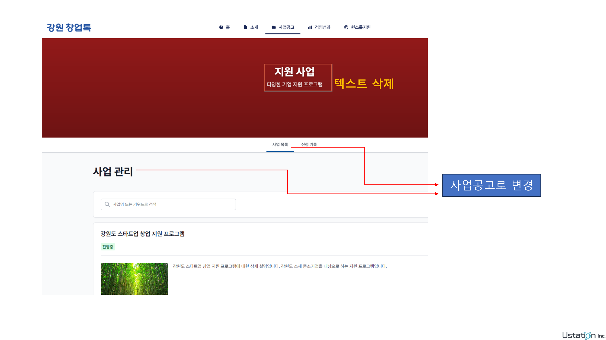

### 📝 Text Content

```
텍스트 삭제
사업공고로 변경
```

### ✍️ Notes

> **需求 #1**: 删除所有 Banner 横幅上的文字 + 修改页面标题文本
>
> **原文**:
>
> - "텍스트 삭제" (删除文本)
> - "사업공고로 변경" (改为事业公告)
>
> **用户明确**:
>
> 1. 所有的 banner 都去掉文字
> 2. "사업 관리" → "사업공고"
> 3. "사업 목록" → "사업공고"
>
> **实施**: ✅ 已完成
>
> **修改 1 - 删除 Banner 文字**:
>
> - 文件: `frontend/src/shared/components/Banner.jsx`
> - 修改: 注释掉文字覆盖层（Overlay）
> - 影响: 所有页面的 Banner（首页、关于、事业公告、经营成果、一站式支持等）
>
> **修改 2 - 页面标题文本**:
>
> - 文件: `frontend/src/member/modules/projects/locales/ko.json`
>   - `projects.title`: "사업 관리" → "사업공고"
>   - `projects.tabs.projectList`: "사업 목록" → "사업공고"
> - 文件: `frontend/src/member/modules/projects/locales/zh.json`
>   - `projects.title`: "支援事业管理" → "事业公告"
>   - `projects.tabs.projectList`: "支援事业列表" → "事业公告"
>
> **优先级**: 高
>
> **状态**: ✅ 已完成

---

## Page 2

### 📷 Page Image

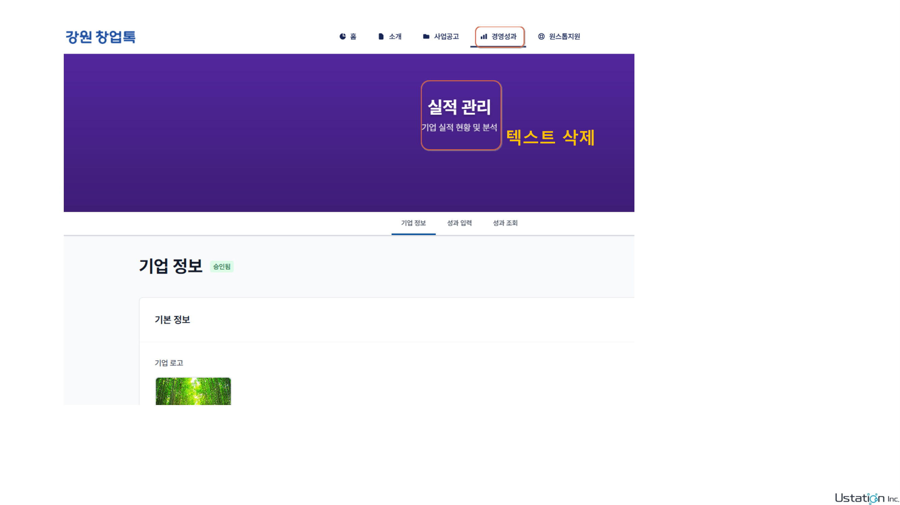

### 📝 Text Content

```
텍스트 삭제
```

### ✍️ Notes

> **需求 #1**: 删除所有 Banner 横幅上的文字（续 Page 2）
>
> **原文**: "텍스트 삭제" (删除文本)
>
> **实施**: ✅ 已完成（同 Page 1）
>
> **状态**: ✅ 已完成

---

## Page 3

### 📷 Page Image

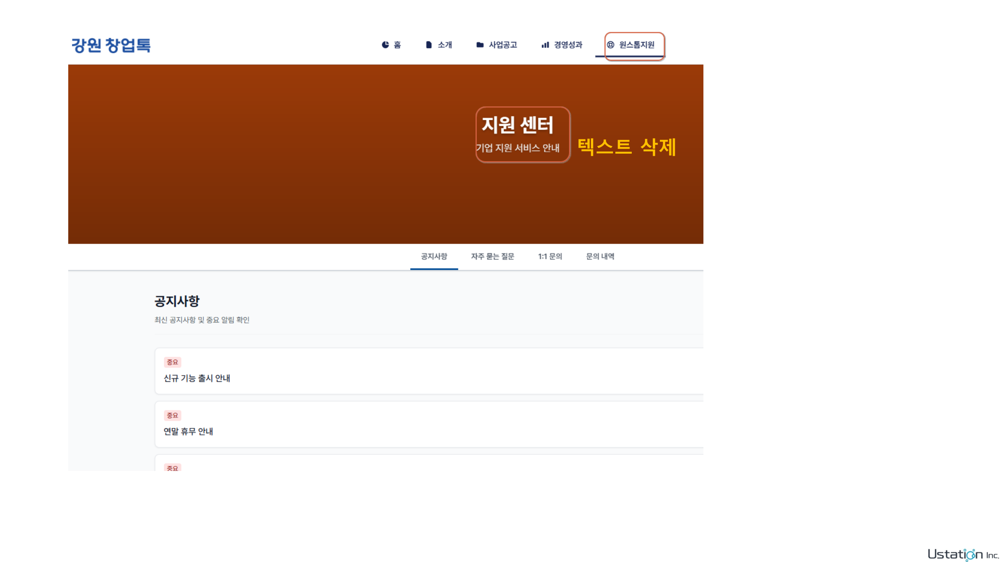

### 📝 Text Content

```
텍스트 삭제
```

### ✍️ Notes

> **需求 #1**: 删除所有 Banner 横幅上的文字（续 Page 3）
>
> **原文**: "텍스트 삭제" (删除文本)
>
> **实施**: ✅ 已完成（同 Page 1）
>
> **状态**: ✅ 已完成

---

## Page 4

### 📷 Page Image

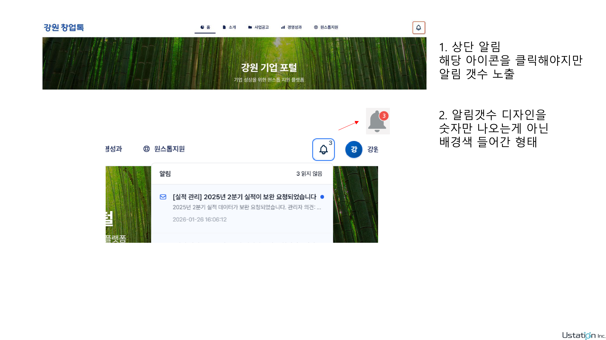

### 📝 Text Content

```
1. 상단 알림
해당 아이콘을 클릭해야지만
알림 갯수 노출
2. 알림갯수 디자인을
숫자만 나오는게 아닌
배경색 들어간 형태
```

### ✍️ Notes

> **需求 #2**: 通知功能优化
>
> **原文**:
>
> 1. 상단 알림 - 해당 아이콘을 클릭해야지만 알림 갯수 노출
> 2. 알림갯수 디자인을 숫자만 나오는게 아닌 배경색 들어간 형태
>
> **翻译**:
>
> 1. 顶部通知 - 不需要点击图标就显示通知数量（徽章始终可见）
> 2. 通知数量设计不应只显示数字，需要带背景色的形式
>
> **实施**: ✅ 已完成
>
> **修改内容**:
>
> 1. **徽章样式** - 红色背景 + 白色文字 + 白色边框
> 2. **自动刷新** - 每 1 分钟自动更新未读数量
> 3. **页面加载** - 组件加载时立即显示未读数量
> 4. **前后端支持** - admin 和 member 都有小铃铛
> 5. **消息类型** - 同时显示线程消息和直接消息
> 6. **点击处理** - 线程消息打开 modal，直接消息跳转到消息列表
> 7. **后端修复** - 修复 `get_unread_count` 函数，正确计算会员端未读数量
>
> **修改文件**:
>
> - `frontend/src/shared/components/NotificationBell.jsx` - 前端通知铃铛组件
> - `backend/src/common/modules/supabase/message_service.py` - 后端未读数量计算
>
> **技术细节**:
>
> - 会员端未读数 = 线程内管理员发送的未读消息 + 直接消息（系统通知）
> - 管理员端未读数 = 线程内会员发送的未读消息
> - 使用 `useEffect` + `setInterval` 实现定时刷新
> - 使用 `useRef` 管理定时器，避免内存泄漏
>
> **优先级**: 高
>
> **状态**: ✅ 已完成

---

## Page 5

### 📷 Page Image

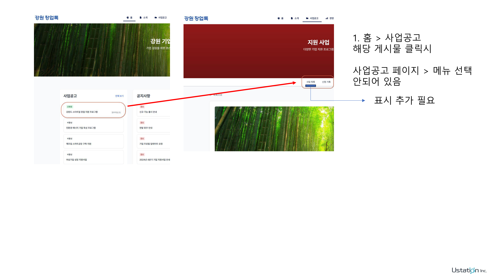

### 📝 Text Content

```
1. 홈 > 사업공고
해당 게시물 클릭시
사업공고 페이지 > 메뉴 선택
안되어 있음
표시 추가 필요
```

### ✍️ Notes

> **需求 #3**: 导航菜单状态显示
>
> **原文**: 홈 > 사업공고 - 해당 게시물 클릭시 사업공고 페이지 > 메뉴 선택 안되어 있음, 표시 추가 필요
>
> **翻译**: 首页 > 事业公告 - 点击帖子时，事业公告页面的菜单选择状态未显示，需要添加标识
>
> **实施**: ✅ 已完成
>
> - 修改 `ProjectSubmenu.jsx`：将 "사업 목록" 的 `exact` 改为 `false`
> - 确保详情页也会激活此菜单项
>
> **文件**: `frontend/src/member/modules/projects/components/ProjectSubmenu.jsx`
>
> **优先级**: 中

---

## Page 6

### 📷 Page Image

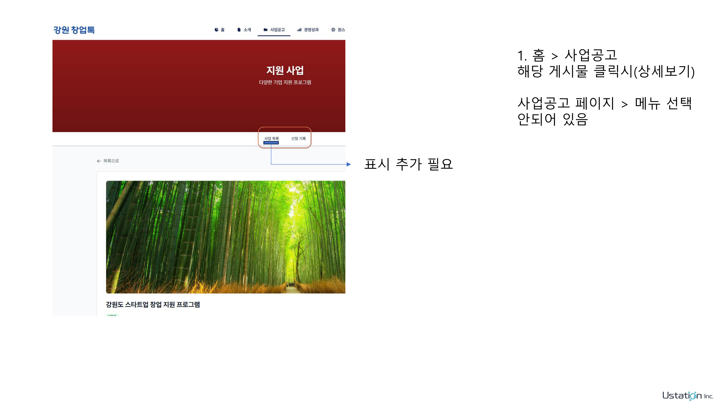

### 📝 Text Content

```
1. 홈 > 사업공고
해당 게시물 클릭시(상세보기)
사업공고 페이지 > 메뉴 선택
안되어 있음
표시 추가 필요
```

### ✍️ Notes

> **需求 #3**: 导航菜单状态显示（详情页）
>
> **原文**: 홈 > 사업공고 - 해당 게시물 클릭시(상세보기) 사업공고 페이지 > 메뉴 선택 안되어 있음, 표시 추가 필요
>
> **翻译**: 首页 > 事业公告 - 点击帖子（详情页）时，事业公告页面的菜单选择状态未显示，需要添加标识
>
> **实施**: ✅ 已完成（同 Page 5）
>
> **优先级**: 中

---

## Page 7

### 📷 Page Image

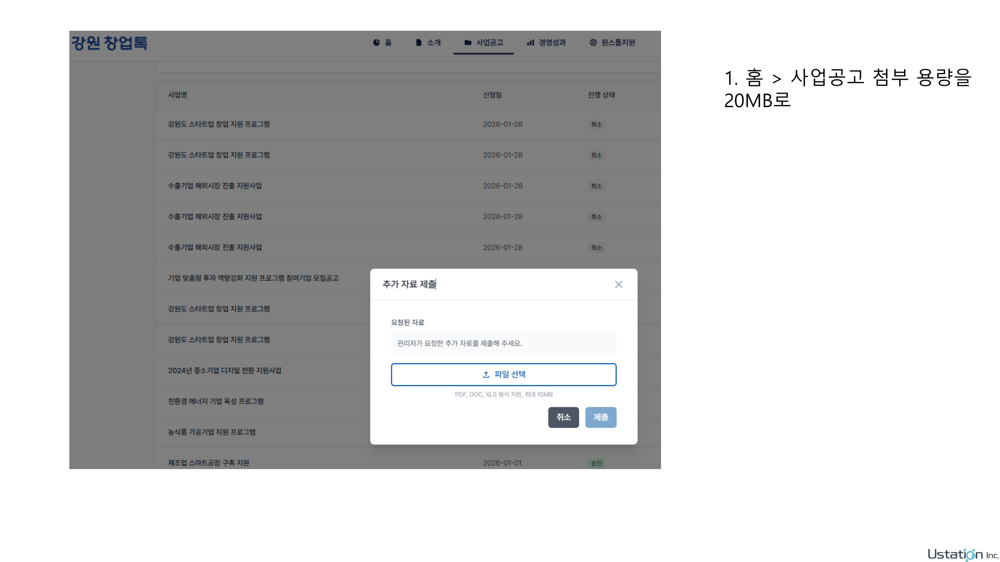

### 📝 Text Content

```
1. 홈 > 사업공고첨부 용량을
20MB로
```

### ✍️ Notes

> **需求 #4**: 文件上传容量限制
>
> **原文**: 홈 > 사업공고첨부 용량을 20MB로
>
> **翻译**: 首页 > 事业公告附件容量调整为 20MB
>
> **实施**: ✅ 已完成
>
> - 前端：`constants.js`, `helpers.js` - MAX_FILE_SIZE = 20MB
> - 后端：`settings.py` - MAX_UPLOAD_SIZE = 20MB, MAX_DOCUMENT_SIZE = 20MB
>
> **文件**:
>
> - `frontend/src/shared/utils/constants.js`
> - `frontend/src/shared/utils/helpers.js`
> - `backend/src/common/modules/config/settings.py`
>
> **优先级**: 高

---

## Page 8

### 📷 Page Image

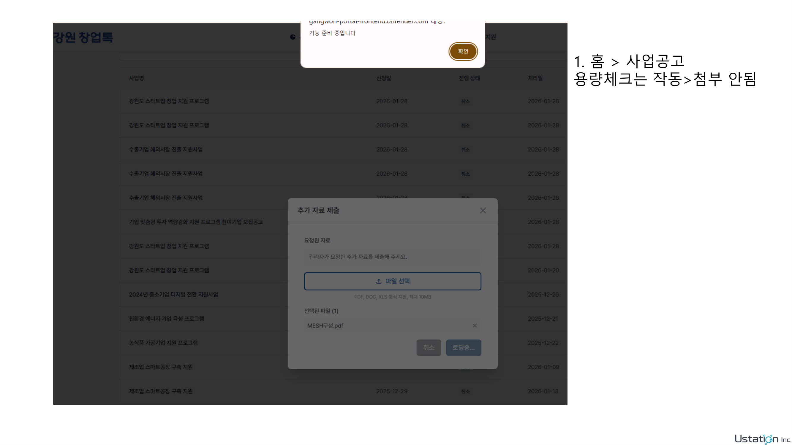

### 📝 Text Content

```
1. 홈 > 사업공고
용량체크는 작동>첨부 안됨
```

### ✍️ Notes

> **需求 #4**: 文件上传容量检查
>
> **原文**: 홈 > 사업공고 - 용량체크는 작동>첨부 안됨
>
> **翻译**: 首页 > 事业公告 - 容量检查正常但无法上传
>
> **实施**: ✅ 已完成
>
> - 确保前后端容量限制一致（20MB）
>
> **优先级**: 高

---

## Page 9

### 📷 Page Image

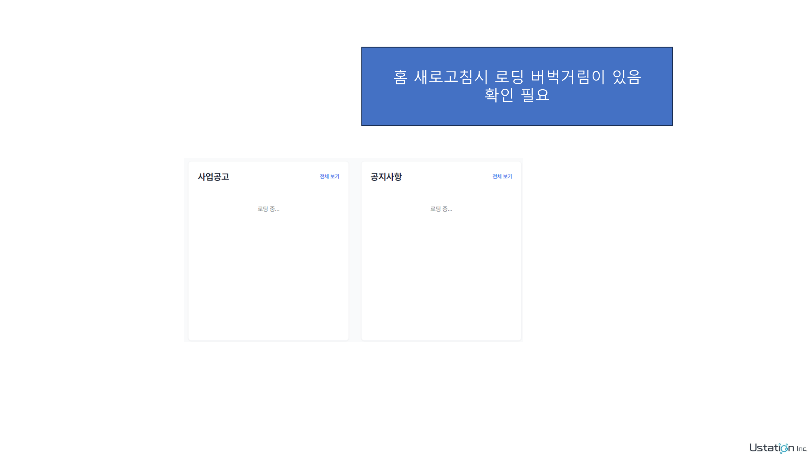

### 📝 Text Content

```
홈 새로고침시 로딩 버벅거림이 있음
확인 필요
```

### ✍️ Notes

> **需求 #5**: 首页加载性能问题
>
> **原文**: 홈 새로고침시 로딩 버벅거림이 있음, 확인 필요
>
> **翻译**: 首页刷新时加载卡顿，需要确认
>
> **实施**: ✅ 已完成
>
> - 优化 `useNoticesPreview.js`：移除不必要的依赖
> - 优化 `useProjectPreview.js`：移除不必要的依赖
> - 添加 React.memo 到 `HomePage.jsx`
>
> **文件**:
>
> - `frontend/src/member/modules/home/hooks/useNoticesPreview.js`
> - `frontend/src/member/modules/home/hooks/useProjectPreview.js`
> - `frontend/src/member/modules/home/components/HomePage/HomePage.jsx`
>
> **优先级**: 高

---

## Page 10

### 📷 Page Image

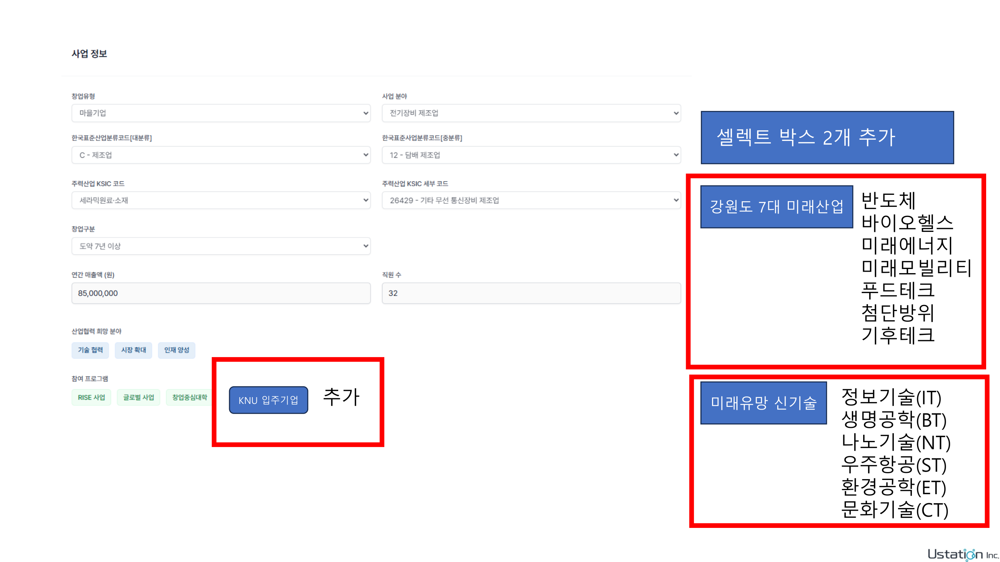

### 📝 Text Content

```
반도체
바이오헬스
미래에너지
미래모빌리티
푸드테크
첨단방위
기후테크
정보기술(IT)
생명공학(BT)
나노기술(NT)
우주항공(ST)
환경공학(ET)
문화기술(CT)
셀렉트 박스 2개 추가
강원도 7대 미래산업
미래유망 신기술
KNU 입주기업
추가
```

### ✍️ Notes

> **需求 #6**: 选择框选项扩展
>
> **原文**:
>
> - 셀렉트 박스 2개 추가
> - 강원도 7대 미래산업: 반도체, 바이오헬스, 미래에너지, 미래모빌리티, 푸드테크, 첨단방위, 기후테크
> - 미래유망 신기술: 정보기술(IT), 생명공학(BT), 나노기술(NT), 우주항공(ST), 환경공학(ET), 문화기술(CT)
> - KNU 입주기업 추가
>
> **翻译**:
>
> - 添加 2 个选择框
> - 江原道 7 大未来产业：半导体、生物健康、未来能源、未来移动、食品科技、尖端防卫、气候科技
> - 未来有望新技术：信息技术(IT)、生命工程(BT)、纳米技术(NT)、宇宙航空(ST)、环境工程(ET)、文化技术(CT)
> - KNU 入驻企业
>
> **实施**: ✅ 已完成
>
> - 添加枚举到 `enums.js`
> - 添加翻译到 `ko.json` 和 `zh.json`
>
> **文件**:
>
> - `frontend/src/member/modules/projects/enums.js`
> - `frontend/src/member/modules/projects/locales/ko.json`
> - `frontend/src/member/modules/projects/locales/zh.json`
>
> **优先级**: 中

---

## Page 11

### 📷 Page Image

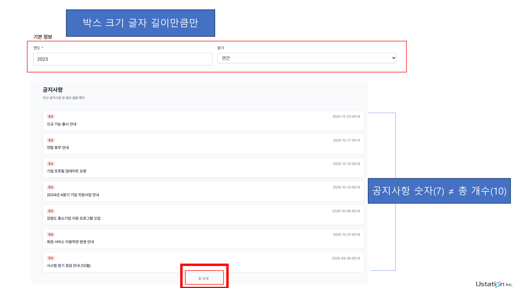

### 📝 Text Content

```
박스 크기 글자 길이만큼만
공지사항 숫자(7) ≠총 개수(10)
```

### ✍️ Notes

> **需求 #7**: 公告数量显示不一致
>
> **原文**:
>
> - 박스 크기 글자 길이만큼만
> - 공지사항 숫자(7) ≠총 개수(10)
>
> **翻译**:
>
> - 盒子大小仅根据文字长度
> - 公告数字(7) ≠ 总数(10)
>
> **实施**: ✅ 已完成
>
> - 修改 `NoticesPage.jsx`：添加自适应宽度的背景盒子
> - 样式：`inline-block` + `px-3 py-1` + `bg-gray-100` + `rounded-full`
>
> **文件**: `frontend/src/member/modules/support/components/NoticesPage/NoticesPage.jsx`
>
> **优先级**: 高

---

## Page 12

### 📷 Page Image

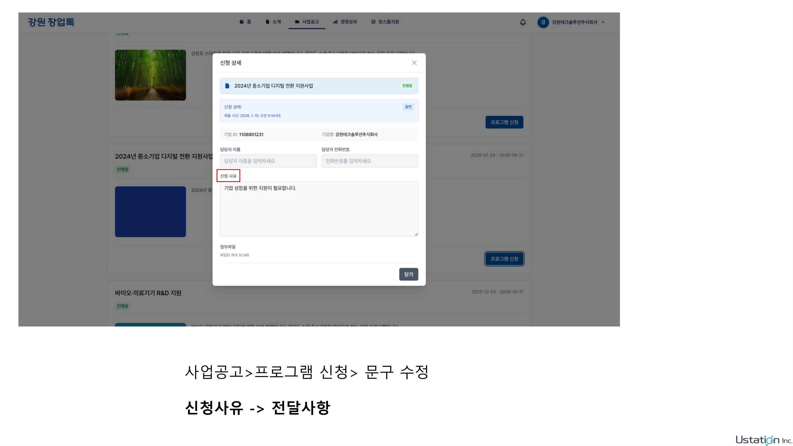

### 📝 Text Content

```
사업공고>프로그램 신청> 문구 수정
신청사유 -> 전달사항
```

### ✍️ Notes

> **需求 #8**: 表单字段文案修改
>
> **原文**: 사업공고>프로그램 신청> 문구 수정 - 신청사유 -> 전달사항
>
> **翻译**: 事业公告>项目申请>文案修改 - 申请理由 -> 传达事项
>
> **实施**: ✅ 已完成
>
> - 修改 `ko.json`：reason, reasonPlaceholder, reasonMinLength
> - 修改 `zh.json`：对应的中文翻译
>
> **文件**:
>
> - `frontend/src/member/modules/projects/locales/ko.json`
> - `frontend/src/member/modules/projects/locales/zh.json`
>
> **优先级**: 低

---

## 实施总结

### ✅ 已完成 (8/8)

1. ✅ **删除 Banner 文字 + 修改页面标题** (Page 1-3)
   - 所有页面横幅去掉标题和副标题
   - "사업 관리" → "사업공고"
   - "사업 목록" → "사업공고"
2. ✅ **通知功能优化** (Page 4) - 徽章始终可见，带背景色
3. ✅ **文件上传容量** (Page 7-8) - 调整为 20MB（前后端一致）
4. ✅ **首页性能优化** (Page 9) - 优化 hooks 依赖，添加 React.memo
5. ✅ **公告数量显示** (Page 11) - 添加自适应宽度样式
6. ✅ **导航菜单状态** (Page 5-6) - 详情页正确显示 active 状态
7. ✅ **选择框扩展** (Page 10) - 添加产业分类枚举和翻译
8. ✅ **表单字段文案** (Page 12) - 修改为"전달사항"

### 📋 相关文档

- 详细需求文档: `bug-fixes-260130.md`
- 原始 PDF: `창업톡 수정사항_260130.pdf`
- 原始 PPTX: `창업톡 수정사항_260130.pptx`

### 🔍 代码调查文件

**已修改的文件**:

- `frontend/src/shared/components/Banner.jsx` - 注释掉文字覆盖层
- `frontend/src/member/modules/projects/locales/ko.json` - 修改页面标题和标签文本
- `frontend/src/member/modules/projects/locales/zh.json` - 修改对应的中文翻译

**影响范围**:

- 所有页面的 Banner 横幅（首页、关于、事业公告、经营成果、一站式支持等）
- 事业公告页面的标题和标签文本
